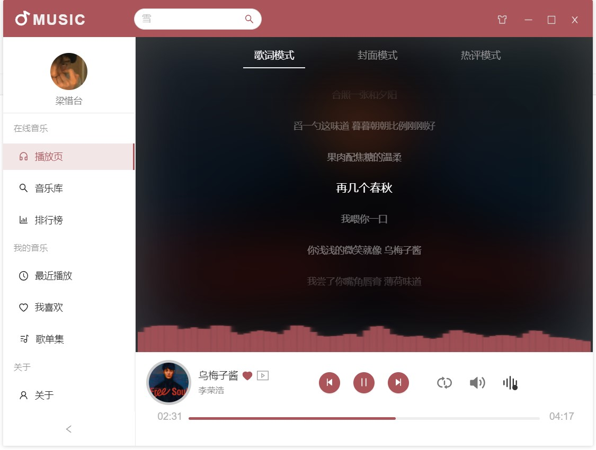
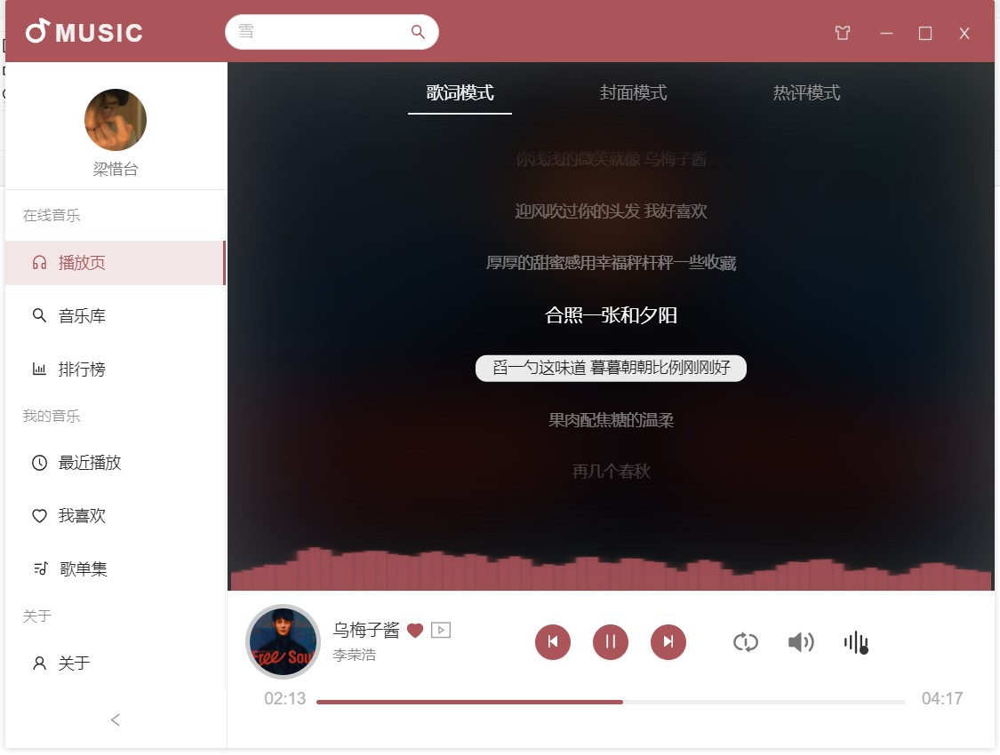
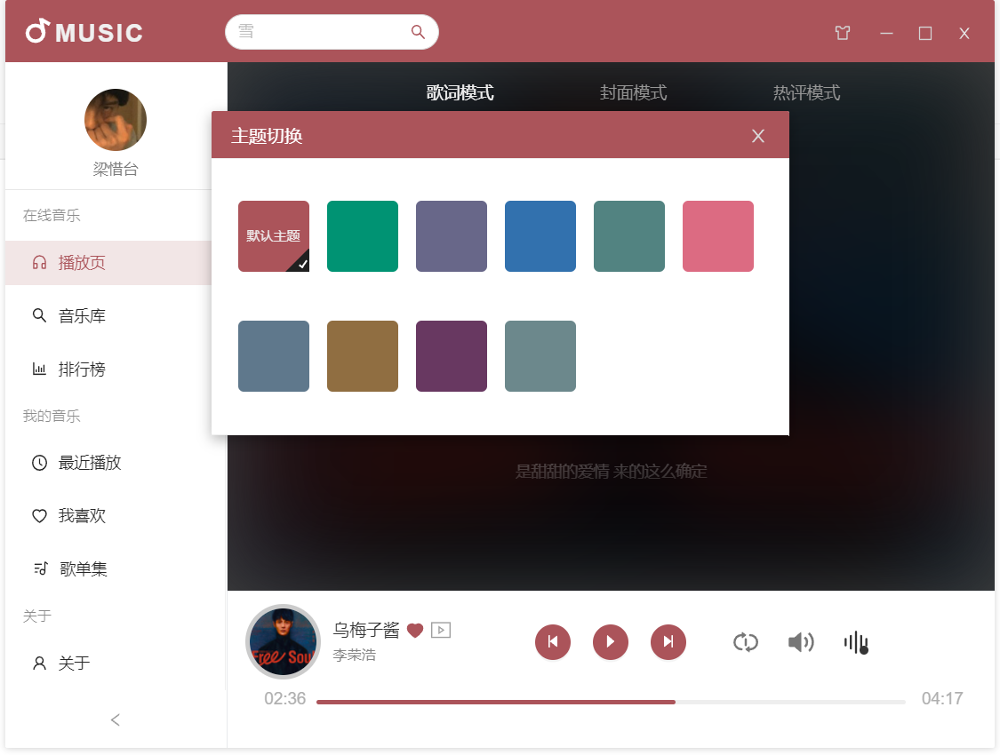
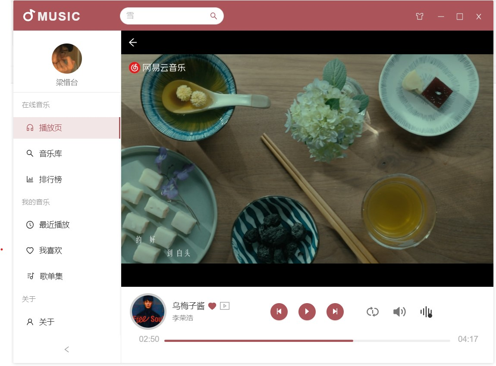

# YourMusicstation

**你的点歌台：** 一款基于Vue 3 + electron的在线音乐播放软件 ，致力于通过该类技术栈深刻理解和掌握前端工程化的内涵，学习复杂数据的渲染处理与UI设计实现，适应未来PC应用的大趋势。 更多软件细节请自行阅读查看源码。  

# 通知
项目已新开`yms-V2`正式生产版本，非特殊情况`V1`将不再更新，详情请移步官网  

> 不建议您以该版本为二开对象（由于本作品是作者学生时期用于练手的项目，项目结构与管理迭代以及可维护性都是狮山，不建议用作生产，除非你有强大的改造能力），仅供初学者理解相关操作和使用  

> 项目API基于[网易云音乐API](https://binaryify.github.io/NeteaseCloudMusicApi)，感谢原作者开源贡献,你需要自行搭建本地或者云API服务接口在`getMusicUtils_wy.ts`文件中替换原本的API接口地址即可实现所有功能

正式版V2官网：https://ymsv2.top

# 应用展示

## 实时音乐频谱
  
## 歌词逐句定位
  

## 主题切换：搭配和参考莫兰迪色系
**同时支持在线搜索、歌词自动翻译匹配、MV播放**

  
  